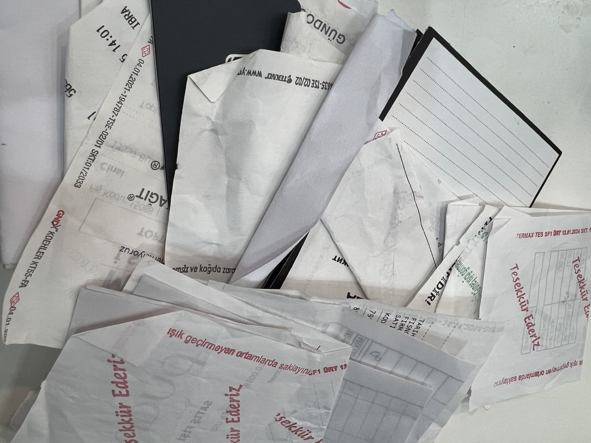
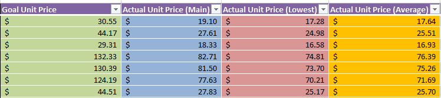
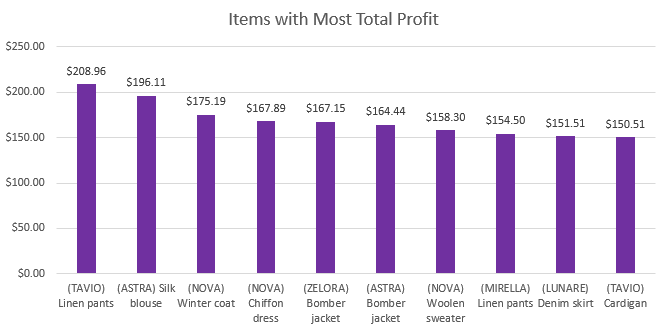
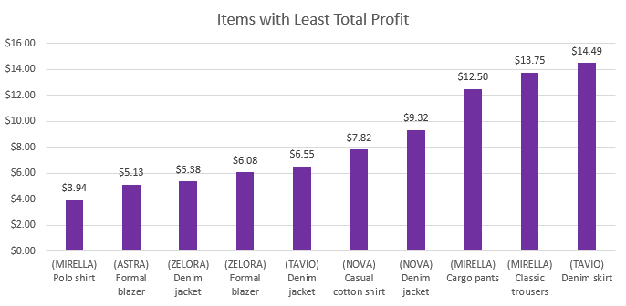
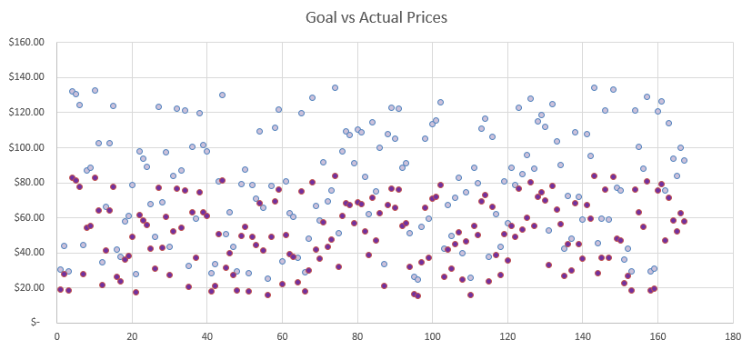
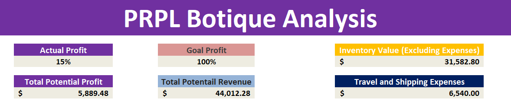

# PRPL Boutique Analysis Report

---

## Introduction

This analysis was conducted for **PRPL**, a boutique retail store. The main objective was to determine how much profit the store generated from its latest collection of goods and to evaluate whether the current pricing strategy aligns with the business’s profitability goals. In addition, the analysis provides recommendations for improving margins and overall financial performance.

 

---

## Data Collection Process

PRPL operates without a digital accounting system or centralized data storage. All invoices and expense records were provided in paper format. To proceed with the analysis:

* Invoices for goods were manually entered into Excel, including item ID, brand, description, quantity, and purchase price.
* Travel, shipping, and hotel expenses associated with acquiring the goods were also entered and aggregated.
* In total, the cost of goods purchased amounted to **\$31,583**, while travel and shipping expenses totaled **\$6,540**, bringing the overall investment to **\$38,123**.

This manual process highlighted a critical inefficiency: the absence of digital records significantly slows down analysis and increases the likelihood of errors.

---

## Goal Margin and Pricing Strategy

Stakeholders set a goal of achieving a **50% profit margin (0.5)**, effectively aiming to double their investment. To incorporate this goal into the analysis:

* A goal unit price was calculated for each item, ensuring that sales at those prices would yield the targeted margin.
* The actual prices set by PRPL were then compared against these calculated goal prices.
* To simulate real sales behavior, two price levels were considered: the main (full) price and the minimum discounted price. Based on stakeholder input, it was assumed that **80% of sales occur at the discounted price** and **20% at the main price**, producing an average selling price for each article.

---

## Findings

* **Current Profitability:**

  * The actual margin achieved was only **0.13**, far below the industry minimum standard of **0.4** and significantly below the goal of **0.5**.
  * With total potential revenue of **\$44,012**, profit amounted to just **\$5,889** — a negligible return considering the \$38,123 investment.

* **Comparison with Goal Prices:**

  * A scatter plot comparing actual vs. goal prices clearly shows that the current pricing strategy undervalues most items.
  * Raising prices to meet the calculated goal levels would align profit margins closer to the industry standard.

* **Brand-Level Insights:**

  * The largest invoice came from **NOVA (\$7,344)**, followed by **TAVIO (\$5,714)** and **LUNARE (\$5,118)**.
  * These brands represent the bulk of inventory spending and therefore have a significant influence on overall performance.

* **Item-Level Insights (total series):**

  * Most Profitable Items (at current pricing):

    * TAVIO line pants series → **\$209 profit**
    * ASTRA silk blouse → **\$196 profit**
  * Least Profitable Items (at current pricing):

    * MIRELLA polo shirt → **\$4 profit**
    * ASTRA formal blazer → **\$5 profit**

These negligible profits on certain articles highlight weaknesses in the current pricing model and inventory decision-making.

---

## Visual Analysis

Several charts were created to support the findings:

* **Total Spent by Brand (Bar Chart):** Shows concentration of costs among a few brands.
* **Items with Most Total Profit (Column Chart):** Highlights which items contribute meaningfully versus which are underperforming.
* **Goal vs. Actual Price Scatter Plot:** Provides a visual demonstration of how actual prices fall short of targeted goal prices.

**Light Purple:** Goal Prices
**Dark Purple:** Actual Prices

---

## Conclusions and Recommendations

1. **Pricing Adjustment:** Immediate action should be taken to raise prices, either strictly to the calculated goal prices or flexibly until at least a 0.5 margin is reached.
2. **Digital Transformation:** Implementing a digital accounting or inventory management system would save time, reduce errors, and enable faster decision-making.
3. **Product Review:** Articles with negligible profits should be reconsidered for future collections unless their strategic value (e.g., drawing customers) justifies keeping them.
4. **Ongoing Monitoring:** Dynamic tools created in Excel (e.g., margin achievement cells) allow the business to monitor and adjust pricing more effectively in real-time.

---

## Disclaimer

This analysis was prepared as part of a real-world project/job. However, the **data, store name, and results presented here are not the original ones**. The dataset was modified and anonymized purely for display and illustrative purposes.

---

## Final Note

This analysis revealed that PRPL’s current pricing strategy is unsustainable, with profits far below industry standards. Adopting a more structured pricing approach aligned with goal margins, supported by digital data management, will significantly improve profitability and strategic decision-making for the boutique.
